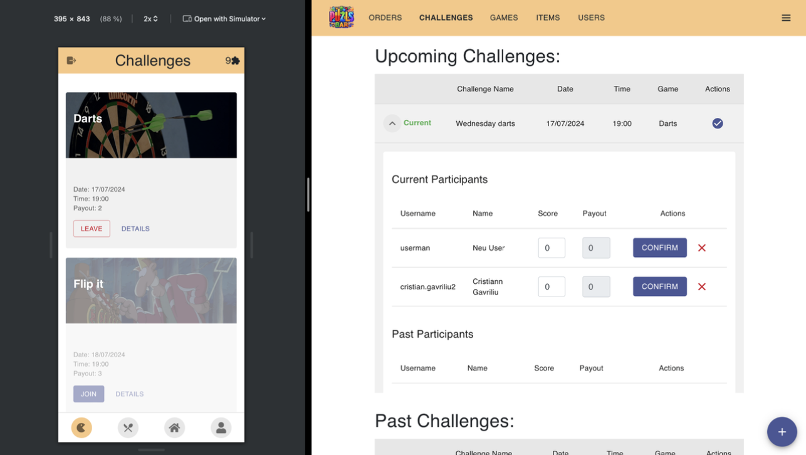

# LoyalTea – Gamified Loyalty Web Platform for Cafes & Bars

## Project Overview
This project was developed at the **Technical University of Munich (TUM)** as part of the **Software Engineering for Business Applications** course during the **Summer Semester 2024**.

**LoyalTea** is an innovative **React-based web application** designed to enhance customer loyalty and engagement for cafes and bars. By integrating **gamification elements**, a **digital rewards system**, and a **streamlined ordering process**, LoyalTea provides an engaging way for customers to interact with their favorite establishments while allowing business owners to gather insights and optimize their offerings.

## Features

- **Digital Loyalty Program** – Customers earn points through purchases, check-ins, and engagement.
- **Gamification & Challenges** – Users participate in quizzes, games, and social challenges.
- **Leaderboards & Rankings** – Encourages friendly competition among customers.
- **Online Order System** – Allows direct ordering via the platform.
- **Admin Dashboard** – Business owners can track customer activity and send notifications.
- **User Authentication** – Secure login and role-based access control.
- **Multi-Device Responsive UI** – Accessible from mobile and desktop devices.

## Important Notes

- **MongoDB Credentials Required**: To run the application, users must enter valid MongoDB database credentials and seed the database accordingly.
- **Stripe**: Add your stripe API key to enable payment processing.

## Image



## Tech Stack

### Frontend
- **React.js** – JavaScript library for building the user interface.
- **React Bootstrap & Material UI** – For responsive design and styling.
- **React Router** – Manages navigation within the app.

### Backend
- **Express.js** – Node.js framework for handling backend operations.
- **MongoDB** – NoSQL database for storing user, order, and challenge data.
- **Mongoose** – ODM (Object Data Modeling) library for MongoDB.
- **JWT Authentication** – Secure user authentication.
- ** Stripe (Payment Integration)** – Enables secure online transactions.

## Important Files

### Frontend
- `src/components/` – Contains reusable React components.
- `src/pages/` – Contains different page components like `LandingPage.js`, `LoginPage.js`, and `App.js`.
- `src/App.js` – Root component managing routing and state.
- `src/index.js` – Entry point of the React application.

### Backend
- `controllers/` – Contains controller files like `itemController.js`, `challengeController.js`, `userController.js`, `orderController.js`, `gameController.js`, and `paymentController.js` which handle different routes and business logic.
- `models/` – Contains model files like `userModel.js`, `orderModel.js`, `challengeModel.js`, and `itemModel.js` which define the schema for different collections in MongoDB.
- `.env` – Environment variables file for storing sensitive information like API keys.
- `index.js` – Main entry point of the backend application, sets up the server and connects to the database.

## Setup & Installation

### Prerequisites

- **Node.js 16+**
- **MongoDB Atlas or Local MongoDB instance**
- **npm or yarn** (for package management)

### Configuring the MongoDB and Stripe Credentials
To enable full functionality, enter your **MongoDB** and **Stripe** credentials in the application:

#### Modify `.env` to include your database and Stripe credentials:

```dotenv
cloud_name=your-mongodb-name
api_key=your-mongodb-url
api_secret=your-secret-key
STRIPE_SECRET_KEY=your-stripe-secret-key
```
### Cloning the Repository
```bash
git clone <https://github.com/cristiangavriliu/loyal-tea.git>
cd <repository-directory>
```

### Setting Up the Backend

1. **Navigate to the backend folder:**
```bash
cd backend
```
2. **Install dependencies:**
```bash
npm install
```
4. **Run the backend server:**
```bash
npm start
```

### Setting Up the Frontend

1. **Navigate to the frontend folder:**
```bash
cd frontend
```
2. **Install dependencies:**
```bash
npm install
```
3. **Start the frontend server:**
```bash
npm start
```

### Running the Application

The frontend will be available at:
**http://localhost:3000/**

The backend API will be available at:
**http://localhost:5000/**

## Alternative Deployment with Docker

How to start the application

1. Open a console in the `loyal-tea` folder and run:
   ```bash
   docker compose up -d
    ```
   
## Future Enhancements

- **Mobile App Integration** – Develop a native app for iOS/Android.
- **Expanded Gamification Features** – More diverse challenges and achievements.
- **Enhanced Business Analytics** – Provide more detailed customer insights.

## Team Members

| Member     | Current Position               |
| ------ |----------------|
| Cristian Gavriliu | M.Sc Information Systems          | 
| Leonard Steindorf | M.Sc Information Systems |
| Kevin Nguyen | M.Sc Information Systems |
| Philipp Eichhorn | M.Sc Information Systems |

## License

This project is for **personal use only** and is intended as a reference point for the projects I have completed during my studies.

---

For further details, refer to the **final project documentation and business model report**.

